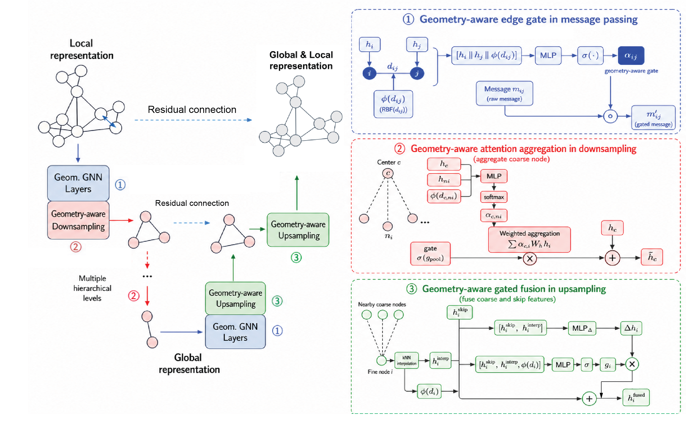

# GAA-SchNet-U-Net for Protein-Ligand Affinity Prediction



This repository contains the implementation of **GAA-SchNet-U-Net**, a geometry-aware Graph U-Net model for protein-ligand binding affinity prediction.

The project benchmarks multi-level graph U-Net architectures on the **ATOM3D LBA** task and studies how different coarse-node construction strategies affect ligand binding affinity prediction. The main model introduces geometry-aware attention/gating into three parts of the U-Net architecture:

1. SchNet-based message passing
2. Downsampling aggregation
3. Upsampling skip-feature fusion

The main finding is that cross-scale geometry-aware operations are more important than local edge gating alone. In particular, geometry-based coarsening such as FPS pooling can perform competitively with semantic residue/fragment coarsening, suggesting that predefined chemical segmentation may not always be necessary for effective U-Net-style molecular hierarchy.

## Task

We evaluate the model on the **Ligand Binding Affinity (LBA)** task from ATOM3D. Each protein-ligand complex is represented as a 3D molecular graph, and the model predicts the binding affinity label.

The training and testing pipeline follows the GET framework. We use the official LBA data split and report results over three random seeds.

## Model Overview

The default model uses SchNet as the local message-passing backbone and adds geometry-aware modules for hierarchical representation learning.

The architecture contains:

* An encoder-decoder Graph U-Net structure
* Geometry-aware message passing
* Geometry-aware attention-based downsampling
* Geometry-aware gated skip fusion during upsampling
* A scalar readout for binding affinity prediction

We also benchmark several downsampling/coarsening strategies:

* Global FPS pooling
* Separate protein/ligand FPS pooling
* Interface-biased sampling
* Semantic residue/fragment coarsening
* Learned node selection

## Main Result

On the ATOM3D LBA benchmark, the final GAA-SchNet-U-Net model achieves competitive performance among strong LBA baselines:

| Model            |        RMSE ↓ |     Pearson ↑ |    Spearman ↑ |
| ---------------- | ------------: | ------------: | ------------: |
| GAA-SchNet-U-Net | 1.328 ± 0.004 | 0.621 ± 0.004 | 0.616 ± 0.005 |

## Training and Testing

We provide a script for training and testing with three random seeds:

```bash
python scripts/exps/exps_3.py \
    --config ./scripts/exps/configs/LBA/unet_geometry.json \
    --gpus 0
```

## Repository Structure

```text
.
├── gaa-schnet-unet/        # Main GAA-SchNet-U-Net implementation
├── gvp-unet/               # GVP-based U-Net experiments
├── scripts/exps/           # Training and evaluation scripts
├── scripts/exps/configs/   # Experiment configuration files
└── gnn-unet.png            # Model overview figure
```

## Third-Party Code

This project builds on several open-source resources:

* **GET**: training framework for SchNet-based LBA experiments
* **ProteinWorkshop**: training framework for GVP-based experiments
* **ATOM3D**: LBA benchmark dataset
* **PyTorch** and **PyTorch Geometric**: model implementation and graph operations
* **Graphein**: protein graph construction utilities

Only the training framework from GET is adopted for SchNet-based experiments; the GAA-SchNet-U-Net architecture and downsampling/coarsening methods are implemented in this repository.

## Reference

The training/testing framework is based on GET:

```bibtex
@inproceedings{kong2024get,
  title     = {Generalist Equivariant Transformer Towards 3{D} Molecular Interaction Learning},
  author    = {Kong, Xiangzhe and Huang, Wenbing and Liu, Yang},
  booktitle = {Proceedings of the 41st International Conference on Machine Learning},
  pages     = {25149--25175},
  year      = {2024},
  editor    = {Salakhutdinov, Ruslan and Kolter, Zico and Heller, Katherine and Weller, Adrian and Oliver, Nuria and Scarlett, Jonathan and Berkenkamp, Felix},
  volume    = {235},
  series    = {Proceedings of Machine Learning Research},
  month     = {21--27 Jul},
  publisher = {PMLR},
  pdf       = {https://raw.githubusercontent.com/mlresearch/v235/main/assets/kong24b/kong24b.pdf},
  url       = {https://proceedings.mlr.press/v235/kong24b.html}
}
```

## Status

This repository is for a course/research project. The corresponding paper/report has not been formally published or posted online.

